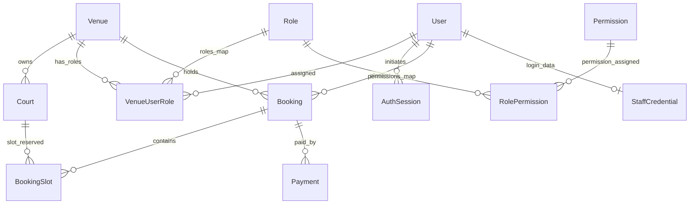

# AI Project Context — Database Schema & Relations

This document details the database models, indices, relationships, and multi-tenancy structures implemented in PostgreSQL via the Prisma Client.

---

## 1. Multi-Tenancy Architecture (Venue Scoping)

The platform is built as a multi-tenant system:
* Every core table includes a `venue_id` foreign key referencing the `venues` table.
* Data isolation is enforced at the database level. For example, queries for courts, schedules, pricing rules, and bookings must always include a filter on `venue_id`.
* The server resolves the active venue identifier from environment configs (or routing context), ensuring that no cross-venue queries are executed in customer sessions.

---

## 2. Model Schema Breakdown

The Prisma schema is defined in the source file [schema.prisma](../../server/prisma/schema.prisma). 
For the detailed business meanings, descriptions, and data types of every column, refer to the product specification [03-DATABASE-SCHEMA.md](02-DATABASE-SCHEMA.md).

Below is the list of active models mapped to their respective tables:

### 2.1 Venue & Court Domain
*   **`Venue` (`venues` table)**: Venue configuration, timezones, currency, rollover time, and active booking days.
*   **`Court` (`courts` table)**: Court surface type, environment (indoor/outdoor), display order, and status (active/maintenance/offline).

### 2.2 Identity & RBAC Domain
*   **`User` (`users` table)**: Global profiles representing customers and operators. Stores phone numbers, verified states, and wallet credits.
*   **`Role` (`roles` table)**: Predefined security roles (`super_admin`, `manager`, `staff`, `customer`).
*   **`Permission` (`permissions` table)**: Access control permission keys (e.g. `edit_pricing`, `manage_bookings`).
*   **`RolePermission` (`role_permissions` table)**: Many-to-many junction mapping roles to permission keys.
*   **`VenueUserRole` (`venue_user_roles` table)**: Assigns roles contextually per venue.
*   **`StaffCredential` (`staff_credentials` table)**: Email/Password authentication hashes and lockout state variables for operators.
*   **`OtpRequest` (`otp_requests` table)**: Tracks customer OTP verification codes and request thresholds.
*   **`AuthSession` (`auth_sessions` table)**: Manages active browser refresh sessions and devices.

### 2.3 Schedule & Pricing Domain
*   **`Schedule` (`schedules` table)**: Default operating hours weekly templates.
*   **`ScheduleException` (`schedule_exceptions` table)**: Daily overrides (closures, modified hours, custom blocks).
*   **`PricingRule` (`pricing_rules` table)**: Peak and weekend pricing multipliers stored in JSONB formats.
*   **`Coupon` (`coupons` table)**: Session discounts checkout codes.

### 2.4 Bookings & Transactions Domain
*   **`Booking` (`bookings` table)**: Tracks slot locks states, totals, discounts, and payment results.
*   **`BookingSlot` (`booking_slots` table)**: Mapped court slot units reserved within a booking session.
*   **`Payment` (`payments` table)**: Transaction audit trails tracking payment gateway states.

---

## 3. Entity Relationships

