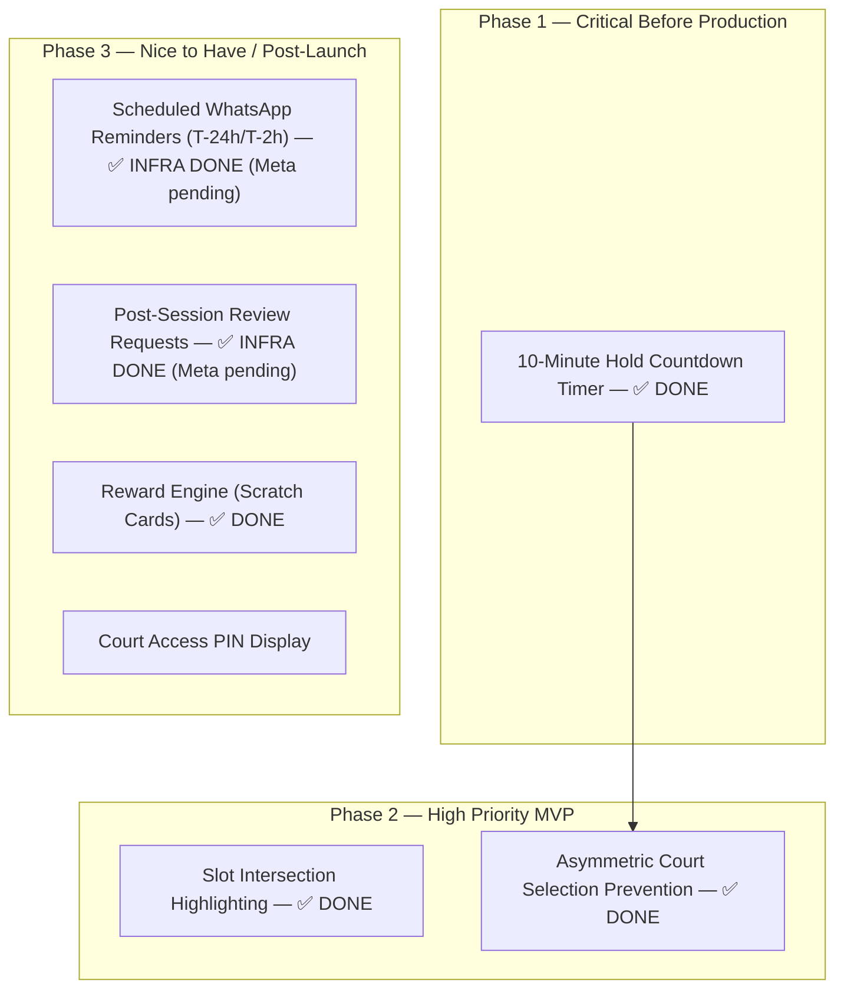

# End-User Feature Gap Analysis — Pickleball Platform

This report presents a comprehensive, repository-wide audit of all remaining customer-facing feature gaps, missing integrations, and deferred workflows on the Pickleball platform. The findings are strictly limited to features and functionalities that are explicitly documented in the project's Markdown (`.md`) files but have not yet been fully implemented in the codebase.

The customer self-service profile update (`PATCH /users/me`) and its `/dashboard/profile` experience are implemented and therefore intentionally do not appear as an outstanding gap in this report. The current implementation and verification evidence are tracked in [02-DOCUMENTED-FEATURE-IMPLEMENTATION-AUDIT.md](02-DOCUMENTED-FEATURE-IMPLEMENTATION-AUDIT.md), Item 5.1.

---

## 1. Availability

### Shared Court Selection Slot Intersection Highlighting
* **Current Status:** ✅ Implemented 2026-07-19
* **Documented in:** [03-UI-UX-SPECIFICATION.md](file:///c:/Users/manis/Projects/Pickleball/docs/product/03-UI-UX-SPECIFICATION.md) Section 2.2 ("Section 4 — Select Time Slots")
* **Description:**
  The UI/UX Specification states: "When both courts are selected, the slot grids must show the intersection of available slots highlighted — slots that are available on at least one court show normally."
* **Delivered:**
  * `getSharedAvailableSlotTimes()` in `bookingEngine.js` computes the start times available on every court; `useBookingSelection.js` exposes the set to the grids.
  * `SlotGrid.js` renders shared slots with a subtle accent-border highlight (selected styling always wins). Covered by unit tests in `web/tests/core.test.js`.
* **User Impact:** Medium (Makes it harder for groups to book consecutive slots spanning both courts).
* **Dependencies:** None.

### Prevention of Asymmetric Multi-Court Selections in UI
* **Current Status:** ✅ Implemented 2026-07-19
* **Documented in:** [02-BUSINESS-LOGIC.md](file:///c:/Users/manis/Projects/Pickleball/docs/product/02-BUSINESS-LOGIC.md) Section 5.1 ("Selection Model")
* **Description:** 
  The business logic requires all selected courts to share the exact same start and end times. Previously the grid allowed mismatched per-court selections that only failed reactively at checkout.
* **Delivered:**
  * All click gestures now run through the pure `reduceSlotClick()` reducer in `bookingEngine.js`, which mirrors one shared time range across every selected court: joining a court mirrors the full range (only if the court is free for all of it), extending the range extends it on all selected courts (refused with an inline notice if any selected court is not free), and tapping a distant slot auto-fills the intermediate slots. Session caps (12 slots / 8 courts, matching backend Joi validators) are refused up-front with clear notices.
  * An asymmetric selection is now unrepresentable in the UI; `buildBookingSelectionPayload` symmetry validation remains as the checkout-time safeguard. Covered by unit tests in `web/tests/core.test.js`, including a regression walk asserting every reachable state passes the symmetry check.
* **User Impact:** Medium (Clunky checkout UX).
* **Dependencies:** None.

---

## 2. Booking & Checkout

### 10-Minute Hold Countdown Timer
* **Current Status:** ✅ Implemented 2026-07-19
* **Documented in:** [03-UI-UX-SPECIFICATION.md](file:///c:/Users/manis/Projects/Pickleball/docs/product/03-UI-UX-SPECIFICATION.md) Section 2.4 ("Checkout — Hold Confirmed")
* **Description:** 
  The UI/UX Specification requests a "countdown timer showing remaining hold time (10 minutes)" on the checkout and waiver screen, backed by a hold that is secured *before* the user reviews checkout.
* **Delivered:**
  * Checkout is commit-on-confirm: the confirm modal opens instantly with the live price preview and reserves nothing; `checkoutBookingAction` runs the whole hold → waiver → initiate-payment transaction when the user clicks the final Confirm & Pay button (`lib/services/checkout.js` — `runCheckout`). Abandoning the review step leaves no server-side state, and slot contention at commit surfaces as a clear conflict message with a grid refresh.
  * From the commit, `useCountdown` (new hook) drives a live m:ss countdown of the 10-minute payment window on the waiver card (`AuthFlow.js`), switching to a danger tone for the final minute; an expired window releases local state, refreshes availability, and returns the user to the grid with an explanatory panel. Server-observed expiry (410 `BOOKING_EXPIRED`) follows the same path.
  * Uncommitted draft selections (courts, slot time ranges, applied coupons) persist in `sessionStorage` (`pb:draft:${venueId}`, version: 1, 2-hour TTL) with calendar date synchronized to the URL search parameter (`?date=YYYY-MM-DD`). The committed hold plus a checkout-view snapshot persist under `pb:hold:${venueId}`, so a dismissed payment popup, closed modal, reload, or return from the gateway can all resume the same payment within the TTL (a "Resume checkout" banner shows the remaining time; `confirmHeldBookingAction` reuses the initiated payment order). Hold-limit (429) failures surface as actionable messages.
* **User Impact:** High (Without a timer, users have no idea how much time they have to pay; slot hoarding or locking conflicts are hidden).
* **Dependencies:** None.

### Court Access PIN Display
* **Current Status:** Completely Missing
* **Documented in:** [02-BUSINESS-LOGIC.md](file:///c:/Users/manis/Projects/Pickleball/docs/product/02-BUSINESS-LOGIC.md) Section 5.2 Step 6, [03-UI-UX-SPECIFICATION.md](file:///c:/Users/manis/Projects/Pickleball/docs/product/03-UI-UX-SPECIFICATION.md) Section 2.5 ("Booking Confirmation Screen"), [schema.prisma](file:///c:/Users/manis/Projects/Pickleball/server/prisma/schema.prisma)
* **Description:** 
  The Prisma schema defines `accessPin String? @map("access_pin") @db.Char(4)` ([schema.prisma:451](file:///c:/Users/manis/Projects/Pickleball/server/prisma/schema.prisma#L451)). The UI/UX Specification notes that the booking confirmation card should display the "Court access PIN (if smart lock integration is active — future feature)." Currently, no pin generation exists on the backend, and `BookingDetailView.js` does not render this field.
* **Missing Pieces:**
  * Implement random 4-digit PIN generation upon payment confirmation in `bookings.service.js`.
  * Update `BookingDetailView.js` to display the PIN for confirmed bookings.
* **User Impact:** Low (Future smart lock integration blocker).
* **Dependencies:** None.

### Payment Redirect Backend Exposure
* **Current Status:** ✅ Implemented 2026-07-19
* **Documented in:** [02-PAYMENT-INTEGRATION.md](file:///c:/Users/manis/Projects/Pickleball/docs/integrations/02-PAYMENT-INTEGRATION.md) Section 1.2 ("System Architecture") and Section 3.3 Steps 7–8, [02-API-SPECIFICATION.md](file:///c:/Users/manis/Projects/Pickleball/docs/specs/02-API-SPECIFICATION.md) Section 8
* **Description:**
  During checkout, the PhonePe payment provider formerly sent the customer's browser through a direct backend callback. That exposed the backend domain and port in the URL bar, showed a raw HTTP redirect, and created cross-origin routing complexity.
* **Delivered:**
  * PhonePe (and the sandbox provider) now configure `merchantUrls.redirectUrl` as `${FRONTEND_BASE_URL}/booking/redirect?orderId=${merchantOrderId}` — the customer's browser only ever sees the frontend domain (`phonepe-payment.provider.js`, `sandbox-payment.provider.js`). The iFrame `CONCLUDED` callback in `BookingClient` likewise navigates to the same-origin `/booking/redirect` route instead of the backend.
  * The new `/booking/redirect` route (named for its role as the `redirectUrl` target, per official PhonePe terminology — "callback" is reserved for the S2S webhook) renders a themed "Confirming Your Payment" interstitial (`PaymentRedirectView`, fully prerendered static shell — the spinner paints instantly) and verifies the order through `verifyPaymentAction`. Verification runs Next-server-to-Express — an improvement over the proposed browser-side fetch: no CORS at all, and the backend origin never appears even in the browser's network log.
  * A new public backend endpoint `GET /api/v1/payments/verify?orderId=...` (PhonePe's "Verify Payment Response" step) verifies with the PhonePe Order Status API and processes terminal states idempotently through the same pipeline as the webhook, returning JSON. It resolves the order against the database before any provider call (404 for junk input) and degrades to `state: "UNKNOWN"` with the booking reference when the gateway is unreachable, so the customer still lands on their booking.
  * All verified orders — COMPLETED, FAILED, and PENDING — land on the unified `/booking/[bookingId]` page (confirmation, failure + retry, or polling from the payment ledger); `/booking/error?type=...` is reserved for unresolvable orders. The backend-hosted browser-redirect handler has been removed entirely — the verify endpoint is the only post-payment verification surface.
* **User Impact:** High (Aesthetic discontinuity, security risk of leaking internal backend ports, and CORS verification friction).
* **Dependencies:** None.

### Unique `merchantOrderId` Generation on Payment Retry
* **Current Status:** ✅ Implemented 2026-07-21
* **Documented in:** [02-PAYMENT-INTEGRATION.md](file:///c:/Users/manis/Projects/Pickleball/docs/integrations/02-PAYMENT-INTEGRATION.md) Section 9.2 ("Retry Logic")
* **Description:**
  When a gateway payment fails or is cancelled, the payment record transitions to `failed` in the database while the underlying booking hold remains active (`pending_payment` state) for the duration of its 10-minute TTL. Clicking "Try Again" on the failure screen or resuming payment from the booking page invokes `POST /api/v1/bookings/:id/initiate-payment` to create a new gateway checkout order. The former booking-only ID would have made every retry use the same gateway order and PhonePe would reject it with HTTP 400.
* **Delivered:**
  * `generateMerchantOrderId` now produces `PP-<14-char-booking-prefix>-<16-hex-char-crypto-suffix>` (34 characters). The fresh 64-bit cryptographic suffix makes each gateway attempt distinct while remaining below PhonePe's 35-character maximum.
  * The generated value is persisted in the unique `payments.merchant_order_id` column before it is returned to the client. `getPaymentWithBooking` resolves that exact ledger value for verification, webhooks, protected status polling, and reconciliation, so retry attempts cannot be confused.
  * Unit coverage proves retry values differ, retain the traceable booking prefix, use PhonePe-safe characters, and fit the length limit.
* **User Impact:** High (Prevents users from retrying payment when a gateway attempt fails or is cancelled).
* **Dependencies:** None.

---

## 3. Notifications

### Scheduled WhatsApp Reminders (T-24h / T-2h)
* **Current Status:** ✅ Implemented — infrastructure built 2026-07-28 (delivery pending Meta activation)
* **Documented in:** [02-BUSINESS-LOGIC.md](file:///c:/Users/manis/Projects/Pickleball/docs/product/02-BUSINESS-LOGIC.md) Section 8 ("Automated Notification Matrix"), [ADR-011](file:///c:/Users/manis/Projects/Pickleball/docs/adrs/ADR-011-notifications-module.md), [01-DATABASE-SCHEMA.md](file:///c:/Users/manis/Projects/Pickleball/docs/specs/01-DATABASE-SCHEMA.md) Domain G
* **Description:**
  The notification matrix defines scheduled WhatsApp reminders to be sent before the player's scheduled play time, **24 hours** and **2 hours** ahead. The complete scheduling infrastructure, business logic, dispatch handlers, transport abstraction, and admin controls are now implemented. Only Meta configuration remains.
* **Delivered:**
  * A PostgreSQL-backed notification outbox driven by the existing in-process scheduler (`dispatch-due-notifications` job) — no BullMQ/pg-boss needed, no Redis (ADR-011). Idempotent, retry-with-backoff, dead-letter, fully audited.
  * A notification **planner** injected into all three booking-confirmation transactions (mirroring the reward-issuance seam) that schedules T-24h + T-2h reminder rows inside the confirm transaction. Phantom/late payments (force-expired bookings) schedule nothing.
  * A **dispatcher** that claims due rows, re-checks booking eligibility at dispatch time, and sends via a WhatsApp transport that runs in **dry-run mode** until Meta is configured.
  * A **notification transport** abstraction (`notifications.transport.js`) that can later support Meta WhatsApp delivery with no change to scheduling/business logic.
  * An admin toggle (`reminders_enabled`) on `/admin/settings`, gated by `manage_venues` (super_admin).
* **Remaining (Meta-only):** Meta credentials, approved `reminder_t24`/`reminder_t2h` utility templates, `NOTIFICATIONS_TRANSPORT_MODE=live`, enable the toggle.
* **User Impact:** Medium.
* **Dependencies:** None (Meta activation).

### Post-Session WhatsApp Review Requests
* **Current Status:** ✅ Implemented — infrastructure built 2026-07-28 (delivery pending Meta activation)
* **Documented in:** [02-BUSINESS-LOGIC.md](file:///c:/Users/manis/Projects/Pickleball/docs/product/02-BUSINESS-LOGIC.md) Section 8 ("Automated Notification Matrix"), [ADR-011](file:///c:/Users/manis/Projects/Pickleball/docs/adrs/ADR-011-notifications-module.md), [01-DATABASE-SCHEMA.md](file:///c:/Users/manis/Projects/Pickleball/docs/specs/01-DATABASE-SCHEMA.md) Domain G
* **Description:**
  After a booking has ended, the system automatically schedules a WhatsApp review request containing a direct review link (`/review/{bookingId}`). The complete scheduling and notification logic is implemented; delivery activates after Meta WhatsApp integration.
* **Delivered:**
  * Admin toggle (`review_requests_enabled`) on `/admin/settings` (`manage_venues`).
  * The planner schedules a `review_request` row targeting the booking's session-end UTC inside the confirm transaction.
  * The dispatcher sends it **only once the booking reaches `completed`** (released back to `scheduled` while the completion sweeper catches up; gives up after a 48h max delay), with the absolute review link `${FRONTEND_BASE_URL}/review/{bookingId}` built into the template parameters.
* **Remaining (Meta-only):** approved `review_request` utility template + the shared Meta activation steps above.
* **User Impact:** Medium (reduces organic user review collection until activated).
* **Dependencies:** Scheduled WhatsApp Reminders infrastructure (shared).

**How the notification features work together end-to-end:**
1. Admin enables the toggles at `/admin/settings` (`manage_venues`, super_admin).
2. When a booking is confirmed (online payment, wallet-only, or admin walk-in), the notification planner runs inside the confirm transaction and inserts the reminder + review-request outbox rows the venue has enabled. A rolled-back confirmation leaves no rows; a duplicate confirm signal is absorbed by `UNIQUE (booking_id, type)`.
3. The existing scheduler's `dispatch-due-notifications` job claims due rows each cycle, re-checks booking eligibility at dispatch time (cancellations/expiry are honored — no message ever goes out for a voided booking), and sends via the transport. Today that transport is **dry-run**: it logs the would-be message and marks the row `sent` with `provider: 'dry_run'`, so the whole pipeline is exercised and observable with zero real delivery.
4. Failed deliveries retry with backoff and dead-letter at `maxAttempts`, all visible in `GET /notifications/log` (`manage_bookings`) and the settings page's recent-activity panel.

**Remaining pending until Meta setup is completed (~30 days out):**
* Meta credentials + WABA/phone-number ID (`WHATSAPP_ACCESS_TOKEN`, `WHATSAPP_PHONE_NUMBER_ID`).
* The three approved utility templates (`WHATSAPP_REMINDER_T24_TEMPLATE_NAME`, `WHATSAPP_REMINDER_T2H_TEMPLATE_NAME`, `WHATSAPP_REVIEW_TEMPLATE_NAME`).
* `NOTIFICATIONS_TRANSPORT_MODE=live` (config-build validation enforces the credentials + templates in production).
* Webhook registration + any Meta-specific final settings.

See [ADR-011](file:///c:/Users/manis/Projects/Pickleball/docs/adrs/ADR-011-notifications-module.md) for the architecture decision and [01-WHATSAPP-INTEGRATION.md](file:///c:/Users/manis/Projects/Pickleball/docs/integrations/01-WHATSAPP-INTEGRATION.md) for the template + cost details.

---

## 4. Other User Features

### Reward Engine (Scratch Cards / Voucher Prizes)
* **Current Status:** ✅ Implemented (2026-07-16)
* **Documented in:** [ADR-010](file:///c:/Users/manis/Projects/Pickleball/docs/adrs/ADR-010-rewards-module.md), [01-DATABASE-SCHEMA.md](file:///c:/Users/manis/Projects/Pickleball/docs/specs/01-DATABASE-SCHEMA.md) Domain F, [02-API-SPECIFICATION.md](file:///c:/Users/manis/Projects/Pickleball/docs/specs/02-API-SPECIFICATION.md) Sections 10–11
* **Description:** 
  The Reward Engine is live end-to-end: booking confirmation atomically issues reward instances (weighted server-side draw, outcome hidden until reveal); on arrival at the confirmation page the scratch overlay presents itself automatically (closable via a top-right X), and a dismissed card persists as a tappable foil teaser in the right panel above the map that reopens the overlay. Prizes are external offer vouchers (e.g., the venue's F&B stall) with unique codes and staff-tracked redemption. Prizes never touch wallet credits (product direction — see ADR-010).
* **Delivered Pieces:**
  * Backend `rewards` module: issuance inside the booking-confirmation transaction, reveal + voucher issuance, staff redemption, mechanism management (`edit_pricing`), moderation listing (`manage_bookings`), and the expiry sweeper job.
  * Frontend (customer): `RewardExperience` overlay flow (auto-present once → teaser card fallback → reopen on tap) with the `RewardReveal` scratch surface (painted foil, stroke-based scratching, ~55% auto-clear, confetti on wins, accessible no-gesture reveal) on the booking-confirmation page and `/dashboard/rewards`; voucher display with tap-to-copy; "🎁 Scratch Card waiting!" badge on My Bookings.
  * Frontend (admin): `/admin/rewards` panel — voucher redemption desk, mechanism create/edit with live probability-sum validation, pause/activate, and an issued-rewards table with per-row redeem/expire.
* **Remaining (Deferred):** WhatsApp reward notification.
* **User Impact:** Resolved.
* **Dependencies:** None.

---

# Execution & Release Roadmap

The identified gaps are prioritized into three phases to organize development prior to production release.

## Phase 1 — Critical Before Production
*Features that prevent a production-ready, secure user experience.*

1. **10-Minute Hold Countdown Timer & Hold Lock Timing** — ✅ Implemented 2026-07-19
   * *Rationale:* Essential to prevent users from attempting checkout on expired/taken slots, and coordinates client-server timing. Delivered as a hold-first checkout with a live countdown, sessionStorage-backed payment resume, and graceful expiry handling.
2. **Unique `merchantOrderId` Generation on Payment Retry** — ✅ Implemented 2026-07-21
   * *Rationale:* Prevents PhonePe API HTTP 400 rejection on payment retries by appending a unique attempt counter suffix to `merchantOrderId`.

---

## Phase 2 — High Priority
*Important usability or compliance improvements expected in an MVP.*

1. **Shared Court Selection Slot Intersection Highlighting** — ✅ Implemented 2026-07-19
   * *Rationale:* Greatly improves multi-court selection workflow efficiency. Delivered as an accent-border highlight (with legend and accessible labels) on slots open across all courts.
2. **Prevention of Asymmetric Multi-Court Selections in UI** — ✅ Implemented 2026-07-19
   * *Rationale:* Prevents validation alerts on checkout submit by locking inputs earlier. Delivered via the mirrored session-range selection reducer with jump-fill and proactive session caps.
3. **Payment Redirect Backend Exposure** — ✅ Implemented 2026-07-19
   * *Rationale:* PhonePe now returns to the frontend `/booking/redirect` interstitial, which verifies server-to-server and never exposes the backend origin in the browser.

---

## Phase 3 — Nice to Have
*Enhancements that improve user engagement, retention, or support multi-venue scaling.*

1. **Scheduled WhatsApp Reminders (T-24h / T-2h)** — ✅ Infrastructure implemented 2026-07-28 (delivery pending Meta)
   * *Rationale:* Enhances attendance rate and preparedness. Delivered as a PostgreSQL outbox + in-process dispatcher with dry-run transport and admin toggles (ADR-011).
2. **Post-Session WhatsApp Review Requests** — ✅ Infrastructure implemented 2026-07-28 (delivery pending Meta)
   * *Rationale:* Automates review gathering. Shares the same outbox + dispatcher; sends only once the booking is `completed`, with the direct `/review/{bookingId}` link (ADR-011).
3. **Reward Engine (Scratch Cards & Voucher Prizes)** — ✅ Implemented 2026-07-16
   * *Rationale:* Promotes engagement via post-booking gamification (scratch cards). Delivered with voucher-only prizes and staff-tracked redemption (ADR-010).
4. **Court Access PIN Generation & Display**
   * *Rationale:* Preparation for unmanned/smart lock court operations.
