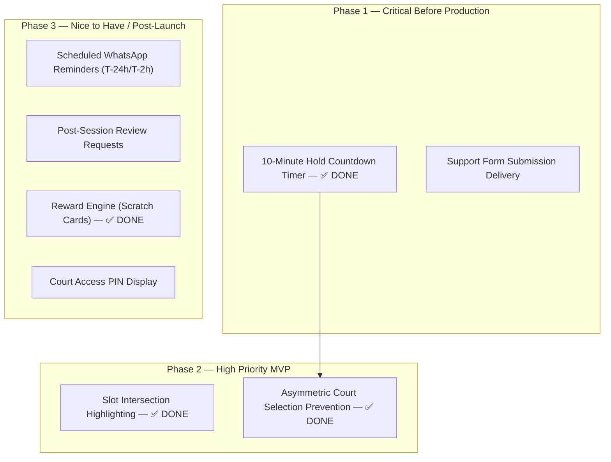

# End-User Feature Gap Analysis — Pickleball Platform

This report presents a comprehensive, repository-wide audit of all remaining customer-facing feature gaps, missing integrations, and deferred workflows on the Pickleball platform. The findings are strictly limited to features and functionalities that are explicitly documented in the project's Markdown (`.md`) files but have not yet been fully implemented in the codebase.

---

## 1. Availability

### Shared Court Selection Slot Intersection Highlighting
* **Current Status:** ✅ Implemented 2026-07-19
* **Documented in:** [03-UI-UX-SPECIFICATION.md](file:///c:/Users/manis/Projects/Pickleball/docs/product/03-UI-UX-SPECIFICATION.md) Section 2.2 ("Section 4 — Select Time Slots")
* **Description:** 
  The UI/UX Specification states: "When both courts are selected, the slot grids must show the intersection of available slots highlighted — slots that are available on at least one court show normally."
* **Delivered:**
  * `getSharedAvailableSlotTimes()` in `bookingEngine.js` computes the start times available on every court; `useBookingSelection.js` exposes the set to the grids.
  * `SlotGrid.js` renders shared slots with a subtle accent-border highlight (selected styling always wins). Covered by unit tests in `web/tests/core.test.js`.
* **User Impact:** Medium (Makes it harder for groups to book consecutive slots spanning both courts).
* **Dependencies:** None.

### Prevention of Asymmetric Multi-Court Selections in UI
* **Current Status:** ✅ Implemented 2026-07-19
* **Documented in:** [02-BUSINESS-LOGIC.md](file:///c:/Users/manis/Projects/Pickleball/docs/product/02-BUSINESS-LOGIC.md) Section 5.1 ("Selection Model")
* **Description:** 
  The business logic requires all selected courts to share the exact same start and end times. Previously the grid allowed mismatched per-court selections that only failed reactively at checkout.
* **Delivered:**
  * All click gestures now run through the pure `reduceSlotClick()` reducer in `bookingEngine.js`, which mirrors one shared time range across every selected court: joining a court mirrors the full range (only if the court is free for all of it), extending the range extends it on all selected courts (refused with an inline notice if any selected court is not free), and tapping a distant slot auto-fills the intermediate slots. Session caps (12 slots / 8 courts, matching backend Joi validators) are refused up-front with clear notices.
  * An asymmetric selection is now unrepresentable in the UI; `buildBookingSelectionPayload` symmetry validation remains as the checkout-time safeguard. Covered by unit tests in `web/tests/core.test.js`, including a regression walk asserting every reachable state passes the symmetry check.
* **User Impact:** Medium (Clunky checkout UX).
* **Dependencies:** None.

---

## 2. Booking & Checkout

### 10-Minute Hold Countdown Timer
* **Current Status:** ✅ Implemented 2026-07-19
* **Documented in:** [03-UI-UX-SPECIFICATION.md](file:///c:/Users/manis/Projects/Pickleball/docs/product/03-UI-UX-SPECIFICATION.md) Section 2.4 ("Checkout — Hold Confirmed")
* **Description:** 
  The UI/UX Specification requests a "countdown timer showing remaining hold time (10 minutes)" on the checkout and waiver screen, backed by a hold that is secured *before* the user reviews checkout.
* **Delivered:**
  * Checkout is commit-on-confirm: the confirm modal opens instantly with the live price preview and reserves nothing; `checkoutBookingAction` runs the whole hold → waiver → initiate-payment transaction when the user clicks the final Confirm & Pay button (`lib/services/checkout.js` — `runCheckout`). Abandoning the review step leaves no server-side state, and slot contention at commit surfaces as a clear conflict message with a grid refresh.
  * From the commit, `useCountdown` (new hook) drives a live m:ss countdown of the 10-minute payment window on the waiver card (`AuthFlow.js`), switching to a danger tone for the final minute; an expired window releases local state, refreshes availability, and returns the user to the grid with an explanatory panel. Server-observed expiry (410 `BOOKING_EXPIRED`) follows the same path.
  * The committed hold plus a checkout-view snapshot persist in `sessionStorage`, so a dismissed payment popup, closed modal, reload, or return from the gateway can all resume the same payment within the TTL (a "Resume checkout" banner shows the remaining time; `confirmHeldBookingAction` reuses the initiated payment order). Hold-limit (429) failures surface as actionable messages.
* **User Impact:** High (Without a timer, users have no idea how much time they have to pay; slot hoarding or locking conflicts are hidden).
* **Dependencies:** None.

### Court Access PIN Display
* **Current Status:** Completely Missing
* **Documented in:** [02-BUSINESS-LOGIC.md](file:///c:/Users/manis/Projects/Pickleball/docs/product/02-BUSINESS-LOGIC.md) Section 5.2 Step 6, [03-UI-UX-SPECIFICATION.md](file:///c:/Users/manis/Projects/Pickleball/docs/product/03-UI-UX-SPECIFICATION.md) Section 2.5 ("Booking Confirmation Screen"), [schema.prisma](file:///c:/Users/manis/Projects/Pickleball/server/prisma/schema.prisma)
* **Description:** 
  The Prisma schema defines `accessPin String? @map("access_pin") @db.Char(4)` ([schema.prisma:451](file:///c:/Users/manis/Projects/Pickleball/server/prisma/schema.prisma#L451)). The UI/UX Specification notes that the booking confirmation card should display the "Court access PIN (if smart lock integration is active — future feature)." Currently, no pin generation exists on the backend, and `BookingDetailView.js` does not render this field.
* **Missing Pieces:**
  * Implement random 4-digit PIN generation upon payment confirmation in `bookings.service.js`.
  * Update `BookingDetailView.js` to display the PIN for confirmed bookings.
* **User Impact:** Low (Future smart lock integration blocker).
* **Dependencies:** None.

### Payment Redirect Backend Exposure
* **Current Status:** Proposed Refinement
* **Documented in:** [02-PAYMENT-INTEGRATION.md](file:///c:/Users/manis/Projects/Pickleball/docs/integrations/02-PAYMENT-INTEGRATION.md) Section 2.2 ("Environment URLs"), Section 6 ("Browser Redirection & Status Check")
* **Description:** 
  During checkout, the PhonePe payment provider configures a direct backend callback URL (`http://localhost:5000/api/v1/payments/redirect?orderId=${merchantOrderId}`). After completing the payment, PhonePe redirects the customer's browser directly to this backend API URL. The browser URL bar briefly exposes the backend domain/port, displaying raw backend-level redirections (HTTP 302) before routing the client back to the frontend (`http://localhost:3000/booking/${bookingId}`). This compromises domain isolation, leaks private API server details to the client browser, and triggers cross-origin routing complexities.
* **Proposed Solution:**
  Establish a dedicated frontend **Payment Callback & Verification Route** (`/booking/callback?orderId=...`). Configure PhonePe to redirect users back to the frontend domain at `${frontendBaseUrl}/booking/callback?orderId=${merchantOrderId}`. On page load, show a themed spinner and reassuring confirmation loading state, while making an asynchronous fetch to the backend `/payments/redirect` endpoint to process and reconcile the payment status, and then smoothly redirect the user to `/booking/${bookingId}` (success) or `/booking/error` (failure).
* **User Impact:** High (Aesthetic discontinuity, security risk of leaking internal backend ports, and CORS verification friction).
* **Dependencies:** None.
* **Note:** The proposed solution is a recommended approach to achieve the best possible end-user experience. If, during subsequent design stages or further technical analysis, an even better architectural solution is identified, it should be proposed instead. The overriding priority is always to implement the best overall solution, even if it differs from the proposed implementation route documented here.

---

## 3. Notifications

### Scheduled WhatsApp Reminders (T-24h / T-2h)
* **Current Status:** Not Started / Deferred (Implementation Planned)
* **Documented in:** [02-BUSINESS-LOGIC.md](file:///c:/Users/manis/Projects/Pickleball/docs/product/02-BUSINESS-LOGIC.md) Section 8 ("Automated Notification Matrix")
* **Description:**
  The notification matrix defines scheduled WhatsApp reminders to be sent before the player's scheduled play time. By default, reminders should be sent **24 hours** and **2 hours** before the play time. Although WhatsApp Meta integration is currently deferred, the complete scheduling infrastructure, business logic, handlers, and admin management should be implemented now so that only Meta configuration will remain when the integration is activated.
* **Missing Pieces:**
  * Integrate a background job scheduler (e.g. BullMQ or pg-boss) into the Express server.
  * Schedule WhatsApp reminder jobs when a booking is confirmed.
  * Implement reminder notification dispatch handlers.
  * Create a notification service abstraction to support future Meta WhatsApp integration.
  * Admin toggle to enable or disable reminder notifications.
  * Admin dashboard to manage reminder schedules, including:

    * Configure how many reminder notifications should be sent.
    * Configure how long before the play time each reminder should be sent (e.g. 24 hours before, 2 hours before, 30 minutes before).
    * View, reschedule, or cancel pending reminder jobs if required.
* **User Impact:** Medium.
* **Dependencies:** None.

### Post-Session WhatsApp Review Requests
* **Current Status:** Not Started / Deferred (Implementation Planned)
* **Documented in:** [02-BUSINESS-LOGIC.md](file:///c:/Users/manis/Projects/Pickleball/docs/product/02-BUSINESS-LOGIC.md) Section 8 ("Automated Notification Matrix")
* **Description:**
  After a booking has ended, the system should automatically schedule a WhatsApp notification requesting the player to review their session. The notification should contain a direct review link (`/review/{bookingId}`). The complete scheduling and notification logic should be implemented now, while actual message delivery will become active after Meta WhatsApp integration is completed.
* **Missing Pieces:**
  * Admin toggle to enable or disable review request notifications.
  * Schedule review request notification jobs when a booking is confirmed, targeting the booking end time.
  * Build the review request notification handler to send a direct review template link (`/review/{bookingId}`).
  * Allow administrators to configure how long after the session ends the review request should be sent.
* **User Impact:** Medium (reduces organic user review collection until activated).
* **Dependencies:** Scheduled WhatsApp Reminders infrastructure.

### WhatsApp Inbound Support Webhook Handler
* **Current Status:** Not Started / Deferred (Implementation Planned)
* **Documented in:** `02-BUSINESS-LOGIC.md` Section 8 ("Automated Notification Matrix")
* **Description:**
  The system should support inbound WhatsApp messages through a webhook handler, allowing users to communicate with the support team directly from WhatsApp. During the current development phase, the webhook architecture, routing, controllers, services, and documentation should be fully implemented. Once the Meta WhatsApp Business Platform is configured, only the webhook registration, environment variables, and Meta-specific configuration should be required to activate the feature.
* **Missing Pieces:**
  * Design and implement the inbound WhatsApp webhook architecture.
  * Define and implement webhook endpoints and route controllers to receive incoming messages.
  * Validate and parse incoming webhook payloads.
  * Build the inbound message processing service.
  * Notify administrators or operators when new support messages are received.
  * Add an Admin toggle to enable or disable inbound support processing.
  * Document the complete inbound support workflow, including webhook verification, message processing, security, logging, error handling, and future support inbox or CRM integration.
* **User Impact:** Low.
* **Dependencies:** None.

**Note:**
WhatsApp Meta Business Platform setup is intentionally deferred and is not expected to begin for approximately the next **30 days**. During this period, all notification infrastructure, scheduling, business logic, APIs, handlers, admin controls, and documentation should be completed within the codebase. Once the Meta setup is completed, only the required environment variables, Meta credentials, webhook registration, template configuration, and any necessary Meta-specific settings should need to be updated to make the entire notification system operational.

The documentation should clearly describe:

* What has been implemented.
* What remains pending until Meta setup is completed.
* How each notification feature works.
* How all notification features work together end-to-end.
* The complete implementation and activation workflow for the **WhatsApp Inbound Support Webhook Handler**, including webhook verification, message processing, operator notifications, logging, and future extensibility.

---

## 4. Help & Support

### Support Form Submission Delivery
* **Current Status:** Mock Only
* **Documented in:** [03-UI-UX-SPECIFICATION.md](file:///c:/Users/manis/Projects/Pickleball/docs/product/03-UI-UX-SPECIFICATION.md) Section 2.8 ("Contact Form")
* **Description:** 
  The contact page `/support` renders a form for names, emails, and messages. However, submitting the form does not transmit data. It invokes a mock handler that displays the error: `"Support form delivery is not configured yet. Please use the listed phone or email contact."` ([SupportClient.js:66](file:///c:/Users/manis/Projects/Pickleball/web/src/components/features/support/SupportClient.js#L66)).
* **Missing Pieces:**
  * Create a support ticket/message endpoint on the backend (or integrate an email delivery service like SendGrid/SES).
  * Update the frontend form to POST to the support endpoint.
* **User Impact:** High (Users attempting to contact support via the web form will receive a failure notice and must manually email or call).
* **Dependencies:** None.

---

## 5. Other User Features

### Reward Engine (Scratch Cards / Voucher Prizes)
* **Current Status:** ✅ Implemented (2026-07-16)
* **Documented in:** [ADR-010](file:///c:/Users/manis/Projects/Pickleball/docs/adrs/ADR-010-rewards-module.md), [01-DATABASE-SCHEMA.md](file:///c:/Users/manis/Projects/Pickleball/docs/specs/01-DATABASE-SCHEMA.md) Domain F, [02-API-SPECIFICATION.md](file:///c:/Users/manis/Projects/Pickleball/docs/specs/02-API-SPECIFICATION.md) Sections 10–11
* **Description:** 
  The Reward Engine is live end-to-end: booking confirmation atomically issues reward instances (weighted server-side draw, outcome hidden until reveal); on arrival at the confirmation page the scratch overlay presents itself automatically (closable via a top-right X), and a dismissed card persists as a tappable foil teaser in the right panel above the map that reopens the overlay. Prizes are external offer vouchers (e.g., the venue's F&B stall) with unique codes and staff-tracked redemption. Prizes never touch wallet credits (product direction — see ADR-010).
* **Delivered Pieces:**
  * Backend `rewards` module: issuance inside the booking-confirmation transaction, reveal + voucher issuance, staff redemption, mechanism management (`edit_pricing`), moderation listing (`manage_bookings`), and the expiry sweeper job.
  * Frontend (customer): `RewardExperience` overlay flow (auto-present once → teaser card fallback → reopen on tap) with the `RewardReveal` scratch surface (painted foil, stroke-based scratching, ~55% auto-clear, confetti on wins, accessible no-gesture reveal) on the booking-confirmation page and `/dashboard/rewards`; voucher display with tap-to-copy; "🎁 Scratch Card waiting!" badge on My Bookings. Scratch card is the only reward experience the web app exposes.
  * Frontend (admin): `/admin/rewards` panel — voucher redemption desk, mechanism create/edit with live probability-sum validation, pause/activate, and an issued-rewards table with per-row redeem/expire.
* **Remaining (Deferred):** Spinner wheel UI component (backend-only support; intentionally absent from the web app), WhatsApp reward notification.
* **User Impact:** Resolved.
* **Dependencies:** None.

---

# Execution & Release Roadmap

The identified gaps are prioritized into three phases to organize development prior to production release.

## Phase 1 — Critical Before Production
*Features that prevent a production-ready, secure user experience.*

1. **10-Minute Hold Countdown Timer & Hold Lock Timing** — ✅ Implemented 2026-07-19
   * *Rationale:* Essential to prevent users from attempting checkout on expired/taken slots, and coordinates client-server timing. Delivered as a hold-first checkout with a live countdown, sessionStorage-backed payment resume, and graceful expiry handling.
2. **Support Form Submission Delivery**
   * *Rationale:* Submitting contact details currently returns an explicit failure notice to the end user.

---

## Phase 2 — High Priority
*Important usability or compliance improvements expected in an MVP.*

1. **Shared Court Selection Slot Intersection Highlighting** — ✅ Implemented 2026-07-19
   * *Rationale:* Greatly improves multi-court selection workflow efficiency. Delivered as an accent-border highlight (with legend and accessible labels) on slots open across all courts.
2. **Prevention of Asymmetric Multi-Court Selections in UI** — ✅ Implemented 2026-07-19
   * *Rationale:* Prevents validation alerts on checkout submit by locking inputs earlier. Delivered via the mirrored session-range selection reducer with jump-fill and proactive session caps.
3. **Payment Redirect Backend Exposure**
   * *Rationale:* Prevents exposing the direct backend API domain and port in the browser address bar and logs.

---

## Phase 3 — Nice to Have
*Enhancements that improve user engagement, retention, or support multi-venue scaling.*

1. **Scheduled WhatsApp Reminders (T-24h / T-2h)**
   * *Rationale:* Enhances attendance rate and preparedness.
2. **Post-Session WhatsApp Review Requests**
   * *Rationale:* Automates review gathering.
3. **Reward Engine (Scratch Cards & Voucher Prizes)** — ✅ Implemented 2026-07-16
   * *Rationale:* Promotes engagement via post-booking gamification (scratch cards). Delivered with voucher-only prizes and staff-tracked redemption (ADR-010); spinner UI and admin screen remain deferred.
4. **Court Access PIN Generation & Display**
   * *Rationale:* Preparation for unmanned/smart lock court operations.
