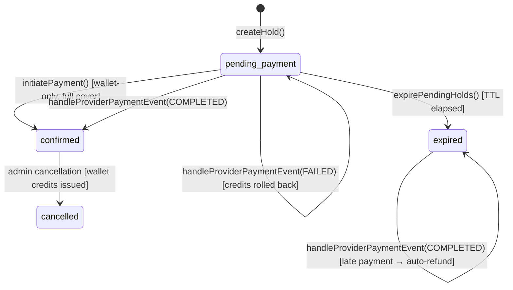
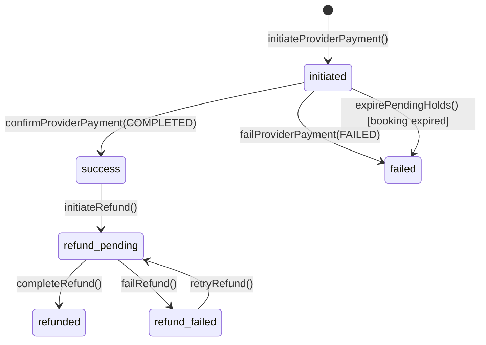

# PhonePe Payment Gateway Integration — Implementation Plan (Revised)

## Executive Summary

This document consolidates the findings from **Phases 1–4** (Repository Audit, Documentation Audit, Payment Domain Analysis, Existing Payment System Audit) and presents the **target-state architecture and implementation plan** (Phases 5–9) for replacing the sandbox payment provider with a production-grade PhonePe PG v2 integration.

The codebase is well-architected with a clean payment provider abstraction (ADR-004). The PhonePe integration documentation ([02-PAYMENT-INTEGRATION.md](file:///c:/Users/manis/Projects/Pickleball/docs/integrations/02-PAYMENT-INTEGRATION.md)) is exceptionally detailed and serves as the authoritative specification. The primary work involves implementing a `phonepe-payment.provider.js` that implements the existing provider interface, adding webhook/redirect endpoints, and updating the frontend to invoke PhonePe's JS checkout bundle.

### Design Decisions (Resolved)

| Decision | Resolution | Impact |
|---|---|---|
| **Credentials** | Configuration-driven placeholders; user provides credentials later | Env schema uses conditional Joi validation — PhonePe vars optional when `NODE_ENV=test`, required otherwise |
| **HTTP Client** | Raw `fetch` (Node.js native); no PhonePe SDK | Zero external dependencies; full control over token management, caching, retries, error handling, and observability |
| **Hookdeck** | User performs setup; implementation delivers comprehensive documentation | New deliverable: `docs/integrations/03-WEBHOOK-LOCAL-DEV.md` |

---

## PHASE 1 — Repository Audit Findings

### 1.1 System Architecture

| Layer | Technology | Location |
|---|---|---|
| Frontend | Next.js 16 (App Router, SSR) | `web/` |
| Backend | Express.js 5 (Node 20+) | `server/` |
| ORM | Prisma 7 (PostgreSQL) | `server/prisma/` |
| Database | PostgreSQL | via `DATABASE_URL` |
| Styling | Tailwind CSS 4 | `web/` |
| Testing | Node.js native test runner | `server/tests/` |

### 1.2 Module Architecture (`server/src/modules/`)

| Module | Purpose | Key Files |
|---|---|---|
| `auth/` | OTP login, staff login, JWT sessions, refresh tokens | 8 files |
| `bookings/` | Hold creation, waiver, pricing, payment initiation, expiry | 9 files |
| `payments/` | Payment provider abstraction, sandbox provider, reconciliation | 9 files |
| `users/` | Profiles, wallet, booking history | 6 files |
| `venues/` | Venues, courts, availability, schedules, pricing rules | 6 files |
| `health/` | Health check endpoints | — |
| `openapi/` | Swagger/OpenAPI doc generation | — |

### 1.3 Payment-Related Inventory

| Component | File | Classification |
|---|---|---|
| Payment Provider Interface | [payment-provider.js](file:///c:/Users/manis/Projects/Pickleball/server/src/modules/payments/payment-provider.js) | **Retain & Extend** |
| Sandbox Payment Provider | [sandbox-payment.provider.js](file:///c:/Users/manis/Projects/Pickleball/server/src/modules/payments/sandbox-payment.provider.js) | **Retain** (test only) |
| Payment Service | [payments.service.js](file:///c:/Users/manis/Projects/Pickleball/server/src/modules/payments/payments.service.js) | **Refactor** — remove sandbox endpoints |
| Payment Controller | [payments.controller.js](file:///c:/Users/manis/Projects/Pickleball/server/src/modules/payments/payments.controller.js) | **Refactor** — remove sandbox handlers |
| Payment Routes | [payments.routes.js](file:///c:/Users/manis/Projects/Pickleball/server/src/modules/payments/payments.routes.js) | **Refactor** — remove sandbox routes |
| Payment Repository | [payments.repository.js](file:///c:/Users/manis/Projects/Pickleball/server/src/modules/payments/payments.repository.js) | **Retain** |
| Reconciliation Service | [reconciliation.service.js](file:///c:/Users/manis/Projects/Pickleball/server/src/modules/payments/reconciliation.service.js) | **Retain** |
| Payment Module Index | [payments/index.js](file:///c:/Users/manis/Projects/Pickleball/server/src/modules/payments/index.js) | **Refactor** — use shared provider factory |
| Payment Validators | [payments.validators.js](file:///c:/Users/manis/Projects/Pickleball/server/src/modules/payments/payments.validators.js) | **Retain** |
| Booking Service (payment flow) | [bookings.service.js](file:///c:/Users/manis/Projects/Pickleball/server/src/modules/bookings/bookings.service.js) | **Retain** — well-structured |
| Booking Repository (payment txns) | [bookings.repository.js](file:///c:/Users/manis/Projects/Pickleball/server/src/modules/bookings/bookings.repository.js) | **Retain** |
| Bookings Module Index | [bookings/index.js](file:///c:/Users/manis/Projects/Pickleball/server/src/modules/bookings/index.js) | **Refactor** — use shared provider factory |
| Frontend Booking Client | [BookingClient.js](file:///c:/Users/manis/Projects/Pickleball/web/src/components/features/booking/BookingClient.js) | **Refactor** — add PhonePe flow |
| Frontend Booking Actions | [booking-actions.js](file:///c:/Users/manis/Projects/Pickleball/web/src/app/actions/booking-actions.js) | **Refactor** — remove sandbox, add redirect |
| Postman Collection | [payments.postman_collection.json](file:///c:/Users/manis/Projects/Pickleball/server/postman/payments.postman_collection.json) | **Update** |
| Unit Tests | [payment-hardening.test.js](file:///c:/Users/manis/Projects/Pickleball/server/tests/unit/payment-hardening.test.js), [payment-provider.test.js](file:///c:/Users/manis/Projects/Pickleball/server/tests/unit/payment-provider.test.js), [reconciliation-flow.test.js](file:///c:/Users/manis/Projects/Pickleball/server/tests/unit/reconciliation-flow.test.js), [wallet-flow.test.js](file:///c:/Users/manis/Projects/Pickleball/server/tests/unit/wallet-flow.test.js) | **Update** |
| Integration Tests | [payment-booking-routes.test.js](file:///c:/Users/manis/Projects/Pickleball/server/tests/integration/payment-booking-routes.test.js) | **Update** |

### 1.4 Environment Variables

**Current** (from [.env.example](file:///c:/Users/manis/Projects/Pickleball/server/.env.example)):
- No PhonePe env vars exist yet
- No `FRONTEND_BASE_URL` / `BACKEND_BASE_URL` exist yet

**Required** (from [02-PAYMENT-INTEGRATION.md §2.4](file:///c:/Users/manis/Projects/Pickleball/docs/integrations/02-PAYMENT-INTEGRATION.md)):
```env
# PhonePe Payment Gateway — Credentials provided by merchant dashboard
# Required in SANDBOX/PRODUCTION environments; optional when NODE_ENV=test
PHONEPE_CLIENT_ID=
PHONEPE_CLIENT_SECRET=
PHONEPE_CLIENT_VERSION=1
PHONEPE_MERCHANT_ID=
PHONEPE_ENV=SANDBOX              # SANDBOX | PRODUCTION
PHONEPE_WEBHOOK_USERNAME=
PHONEPE_WEBHOOK_PASSWORD=

# Base URLs for redirect and webhook routing
FRONTEND_BASE_URL=http://localhost:3000
BACKEND_BASE_URL=http://localhost:5000
```

> [!NOTE]
> **Credential Placeholder Strategy**: The Joi env schema will use conditional validation — PhonePe-specific env vars (`CLIENT_ID`, `CLIENT_SECRET`, `MERCHANT_ID`, `WEBHOOK_USERNAME`, `WEBHOOK_PASSWORD`) will be **optional when `NODE_ENV=test`** (allowing the test suite to run with the sandbox provider) and **required otherwise** (ensuring the app cannot start in staging/production without credentials). `PHONEPE_ENV` defaults to `SANDBOX`. `PHONEPE_CLIENT_VERSION` defaults to `1`.

### 1.5 Database Schema Assessment

The [Payment model](file:///c:/Users/manis/Projects/Pickleball/server/prisma/schema.prisma) is **production-ready** for PhonePe:
- ✅ `gateway` enum includes `phonepe`
- ✅ `merchantOrderId` (unique)
- ✅ `gatewayOrderId`, `gatewayPaymentId`
- ✅ `upiVpa`, `paymentMode`
- ✅ `idempotencyKey` (unique)
- ✅ `merchantRefundId` (unique), `refundAmount`, `refundInitiatedAt`, `refundCompletedAt`
- ✅ `rawWebhookPayload` (JSON)
- ✅ `webhookReceivedAt`

**No schema migration is required.** The existing schema fully supports PhonePe.

### 1.6 Provider Wiring (Critical Architectural Detail)

> [!WARNING]
> The `paymentProvider` is currently instantiated **twice** — once in [bookings/index.js](file:///c:/Users/manis/Projects/Pickleball/server/src/modules/bookings/index.js) (injected into `bookingsService` for `createPaymentOrder()`) and once in [payments/index.js](file:///c:/Users/manis/Projects/Pickleball/server/src/modules/payments/index.js) (injected into `reconciliationService` for `refundPayment()`). Both currently hardcode `createSandboxPaymentProvider()`.
>
> The updated architecture introduces a **shared provider factory** (`provider-factory.js`) that both module index files consume, ensuring a single provider configuration with consistent behavior.

Current wiring in [routes/index.js](file:///c:/Users/manis/Projects/Pickleball/server/src/routes/index.js):
```
createRouter()
  ├── createDefaultBookingsService({ config, venueService })
  │   └── createSandboxPaymentProvider() → injected into bookingsService
  ├── createDefaultPaymentsRouter({ bookingsService, config, authService })
  │   └── createSandboxPaymentProvider() → injected into reconciliationService
```

Target wiring:
```
createRouter()
  ├── createPaymentProviderFromEnv(config)  ← shared factory, called ONCE
  ├── createDefaultBookingsService({ config, venueService, paymentProvider })
  │   └── uses shared provider
  ├── createDefaultPaymentsRouter({ bookingsService, config, authService, paymentProvider })
  │   └── uses shared provider in reconciliationService
  ├── createWebhookRouter({ bookingsService, reconciliationService, config })
```

---

## PHASE 2 — Documentation Audit Findings

### 2.1 Documents Reviewed

| Document | Path | Key Findings |
|---|---|---|
| Docs README | `docs/README.md` | Complete documentation index, 8 ADRs registered |
| ADR-004 | `docs/adrs/ADR-004-booking-lifecycle-payments.md` | **Binding**: Payment provider abstraction interface, sandbox provider, partial unique index concurrency |
| Payment Integration | `docs/integrations/02-PAYMENT-INTEGRATION.md` | **877 lines** — Complete PhonePe v2 spec including OAuth, checkout, webhooks, refunds, wallet, reconciliation, security, testing |
| Implementation Status | `docs/ai/03-IMPLEMENTATION-STATUS.md` | PhonePe Payments = **Planned** status |
| Issues & Debt | `docs/ai/04-ISSUES-AND-DEBT.md` | No payment-related debt items |
| Maintenance Rules | `docs/ai/05-MAINTENANCE-RULES.md` | Codebase is source of truth; doc sync required on changes |
| Business Logic | `docs/product/02-BUSINESS-LOGIC.md` | Booking lifecycle, wallet credits, cancellation policies |

### 2.2 ADR-004 Constraints (Binding)

The payment provider interface from ADR-004 mandates three methods. The current [sandbox-payment.provider.js](file:///c:/Users/manis/Projects/Pickleball/server/src/modules/payments/sandbox-payment.provider.js) already implements all three:
1. `createPaymentOrder({ booking, amount, currency })` → creates a payment order
2. `getPaymentStatus({ payment })` → checks order status
3. `refundPayment({ merchantRefundId, amount })` → initiates refund

> [!IMPORTANT]
> The current [assertPaymentProvider()](file:///c:/Users/manis/Projects/Pickleball/server/src/modules/payments/payment-provider.js) only checks for `createPaymentOrder` (1 of 3 methods). The assertion must be expanded to validate all three methods, ensuring any new provider (PhonePe) implements the complete contract.

### 2.3 Documentation-to-Implementation Gaps

| Spec Requirement | Implementation Status |
|---|---|
| PhonePe OAuth token management | ❌ Not implemented |
| PhonePe `createPaymentOrder` (v2 checkout) | ❌ Not implemented |
| PhonePe `getPaymentStatus` (order status API) | ❌ Not implemented |
| PhonePe webhook endpoint | ❌ Not implemented |
| PhonePe redirect handler | ❌ Not implemented |
| PhonePe refund API integration | ❌ Not implemented |
| PhonePe JS bundle loading (frontend) | ❌ Not implemented |
| Hookdeck webhook forwarding (local dev) | ❌ Not configured (user responsibility, docs required) |
| Missing webhook recovery job | ❌ Not implemented |
| `FRONTEND_BASE_URL` / `BACKEND_BASE_URL` env vars | ❌ Not defined |
| Webhook local development documentation | ❌ Not created |

---

## PHASE 3 — Payment Domain Analysis

### 3.1 Booking-Payment Lifecycle



### 3.2 Payment State Transitions



### 3.3 Key Business Rules (from code and docs)

1. **Hold TTL**: 10 minutes (`holdTtlSeconds = 600`)
2. **Active hold limit**: 2 per user
3. **Waiver required** before payment initiation
4. **Wallet credits** deducted optimistically at payment initiation, rolled back on failure
5. **Minimum PhonePe amount**: ₹1 (100 paisa) — documented requirement
6. **Late payment handling**: If payment succeeds after booking expired, auto-refund + wallet restore
7. **Idempotent confirmation**: Payment status checked before processing (initiated → success only)
8. **UPI-only modes**: UPI_INTENT, UPI_COLLECT, UPI_QR

---

## PHASE 4 — Existing Payment System Audit

### 4.1 Component Disposition Summary

| Component | Disposition | Rationale |
|---|---|---|
| `payment-provider.js` (interface) | **Retain & Extend** | Expand assertion to cover all 3 methods (`createPaymentOrder`, `getPaymentStatus`, `refundPayment`) |
| `sandbox-payment.provider.js` | **Retain for tests** | Keep for unit/integration tests when `NODE_ENV=test`; never instantiated in staging/production |
| `payments.service.js` sandbox methods | **Remove** | `completeSandboxPayment()`, `failSandboxPayment()` — development-only |
| `payments.routes.js` sandbox routes | **Remove** | `GET /sandbox/:id/complete`, `GET /sandbox/:id/fail` |
| `payments.controller.js` sandbox handlers | **Remove** | `completeSandboxPayment`, `failSandboxPayment` |
| `payments/index.js` (hardcoded sandbox) | **Replace** | Switch to shared environment-based provider factory |
| `bookings/index.js` (hardcoded sandbox) | **Replace** | Switch to shared environment-based provider factory |
| BookingClient.js sandbox flow | **Replace** | Replace with PhonePe iFrame/redirect flow |
| `completeSandboxPaymentAction` | **Remove** | Frontend sandbox action |

---

## PHASE 5 — PhonePe Research Summary

> [!NOTE]
> The existing [02-PAYMENT-INTEGRATION.md](file:///c:/Users/manis/Projects/Pickleball/docs/integrations/02-PAYMENT-INTEGRATION.md) is an 877-line, exhaustive PhonePe v2 integration specification. It covers OAuth, checkout, webhooks, refunds, wallet integration, reconciliation, security, and UAT testing. This document serves as the primary implementation reference.
>
> **HTTP Client Decision**: All PhonePe API calls will use Node.js native `fetch` (available in Node 20+). No external HTTP library or PhonePe SDK will be installed. Token management, caching, retry logic, error handling, and observability are implemented in-house within `phonepe-auth.js` and `phonepe-payment.provider.js`.

### Key PhonePe API Details (from docs)

| API | Method | UAT URL | Production URL |
|---|---|---|---|
| OAuth Token | POST | `https://api-preprod.phonepe.com/apis/pg-sandbox/v1/oauth/token` | `https://api.phonepe.com/apis/identity-manager/v1/oauth/token` |
| Create Payment | POST | `https://api-preprod.phonepe.com/apis/pg-sandbox/checkout/v2/pay` | `https://api.phonepe.com/apis/pg/checkout/v2/pay` |
| Order Status | GET | `https://api-preprod.phonepe.com/apis/pg-sandbox/checkout/v2/order/{id}/status` | `https://api.phonepe.com/apis/pg/checkout/v2/order/{id}/status` |
| Refund | POST | `https://api-preprod.phonepe.com/apis/pg-sandbox/checkout/v2/order/refund` | `https://api.phonepe.com/apis/pg/checkout/v2/order/refund` |

### Raw `fetch` Implementation Design

Each outbound PhonePe API call will follow this pattern:

```
1. Acquire OAuth access token (from cache or fresh fetch)
2. Build request (URL, headers with O-Bearer token, JSON body)
3. Execute fetch with AbortController timeout (30s default)
4. Log: request method, URL, latency, response status, correlation ID
5. If 401: invalidate token cache → re-acquire token → retry ONCE
6. If 5xx: exponential backoff (1s, 2s, 4s) → max 3 retries
7. If 4xx (non-401): throw immediately with structured error context
8. Parse response JSON → validate expected shape → return
```

Observability fields logged on every PhonePe API call:
- `correlationId` — UUID per request, passed as `X-Request-Id` header
- `operation` — e.g., `phonepe:createOrder`, `phonepe:checkStatus`, `phonepe:refund`
- `merchantOrderId` — for payment operations
- `latencyMs` — response time
- `httpStatus` — response status code
- `error` — structured error details (if failed)

### Hookdeck for Local Webhook Development

> [!NOTE]
> Hookdeck installation and configuration is the user's responsibility. The implementation will deliver a comprehensive documentation guide (`docs/integrations/03-WEBHOOK-LOCAL-DEV.md`) covering the complete Hookdeck configuration process, webhook forwarding setup, local development workflow, testing procedures, verification steps, troubleshooting guidance, required environment variables, and production considerations.

---

## PHASE 6 — Gap Analysis

| Gap | Severity | Resolution |
|---|---|---|
| No PhonePe provider implementation | **Critical** | Create `phonepe-payment.provider.js` using raw `fetch` |
| No OAuth token management | **Critical** | Create `phonepe-auth.js` with in-house caching, retry, observability |
| No webhook endpoint | **Critical** | Add `POST /api/v1/webhooks/phonepe` |
| No redirect handler | **Critical** | Add `GET /api/v1/payments/redirect` |
| No shared provider factory | **High** | Create `provider-factory.js`; eliminate dual sandbox instantiation in `bookings/index.js` and `payments/index.js` |
| No PhonePe env vars in config/validation | **High** | Extend `env.js` schema with conditional validation |
| No frontend PhonePe JS bundle loading | **High** | Add script to checkout flow |
| No frontend redirect/status pages | **High** | Create `/booking/success`, `/booking/failed`, `/booking/pending` |
| No webhook local dev documentation | **High** | Create `docs/integrations/03-WEBHOOK-LOCAL-DEV.md` |
| No missing webhook recovery job | **Medium** | Create background job for stale `initiated` payments |
| `assertPaymentProvider` only checks 1 of 3 methods | **Medium** | Extend to check all 3 methods |
| No `FRONTEND_BASE_URL`/`BACKEND_BASE_URL` env vars | **Medium** | Add to env schema |
| Sandbox routes exposed without environment gating | **Medium** | Remove from production routes |

---

## PHASE 7 — Target-State Architecture

### 7.1 New Files

| File | Purpose |
|---|---|
| `server/src/modules/payments/provider-factory.js` | Shared provider factory: returns PhonePe provider (when `PHONEPE_ENV` set) or sandbox provider (when `NODE_ENV=test`) |
| `server/src/modules/payments/phonepe-auth.js` | OAuth token fetching via raw `fetch`, in-memory caching with TTL, auto-refresh 60s before expiry, 401 invalidation, structured logging |
| `server/src/modules/payments/phonepe-payment.provider.js` | PhonePe provider implementing 3-method interface via raw `fetch`: `createPaymentOrder`, `getPaymentStatus`, `refundPayment`; includes timeout, retry, observability |
| `server/src/modules/payments/webhook.controller.js` | Webhook handler with SHA256 auth verification, immediate 200 response, async event routing |
| `server/src/modules/payments/webhook.routes.js` | Webhook route (`POST /webhooks/phonepe`) |
| `server/src/modules/payments/redirect.controller.js` | Redirect handler for post-payment browser redirect |
| `server/scripts/reconcile-stale-payments.mjs` | Background job for missing webhook recovery |
| `web/src/app/(public)/booking/success/page.js` | Payment success page |
| `web/src/app/(public)/booking/failed/page.js` | Payment failure page with retry option |
| `web/src/app/(public)/booking/pending/page.js` | Payment pending page with polling |
| `docs/integrations/03-WEBHOOK-LOCAL-DEV.md` | Comprehensive Hookdeck & webhook local development guide |

### 7.2 Modified Files

| File | Changes |
|---|---|
| `server/src/config/env.js` | Add PhonePe env vars + `FRONTEND_BASE_URL`, `BACKEND_BASE_URL` with conditional Joi validation |
| `server/src/modules/payments/payment-provider.js` | Extend `assertPaymentProvider` to validate all 3 methods |
| `server/src/modules/payments/index.js` | Replace hardcoded sandbox with shared `createPaymentProviderFromEnv()` factory; accept `paymentProvider` as injected dependency |
| `server/src/modules/bookings/index.js` | Replace hardcoded sandbox with shared `createPaymentProviderFromEnv()` factory; accept `paymentProvider` as injected dependency |
| `server/src/modules/payments/payments.service.js` | Remove `completeSandboxPayment()` and `failSandboxPayment()` |
| `server/src/modules/payments/payments.controller.js` | Remove sandbox handlers |
| `server/src/modules/payments/payments.routes.js` | Remove sandbox routes, add redirect route |
| `server/src/routes/index.js` | Create provider once via factory; pass to both bookings and payments modules; mount webhook routes at `/webhooks` |
| `server/.env.example` | Add PhonePe env var placeholders with inline documentation |
| `web/src/components/features/booking/BookingClient.js` | Replace sandbox auto-complete with PhonePe iFrame/redirect flow |
| `web/src/app/actions/booking-actions.js` | Remove `completeSandboxPaymentAction` |

### 7.3 Removed Files/Code

| Target | Action |
|---|---|
| Sandbox routes (`/sandbox/:id/complete`, `/sandbox/:id/fail`) | Remove from payment routes |
| `completeSandboxPayment()`, `failSandboxPayment()` in service | Remove |
| `completeSandboxPaymentAction` in frontend actions | Remove |
| Sandbox auto-complete flow in `BookingClient.js` | Remove |
| `import { createSandboxPaymentProvider }` in `bookings/index.js` | Replace with shared factory import |
| `import { createSandboxPaymentProvider }` in `payments/index.js` | Replace with shared factory import |

### 7.4 Architecture Flow

```
Frontend                    Backend                         PhonePe
   │                          │                                │
   │ POST /bookings/:id/      │                                │
   │  initiate-payment ──────►│                                │
   │                          │ 1. getAccessToken()            │
   │                          │    [cache hit or fetch()]─────►│
   │                          │◄── access_token ───────────────│
   │                          │ 2. fetch(POST /checkout/v2/pay)│
   │                          │    [30s timeout, retry on 5xx]─►│
   │                          │◄── { redirectUrl } ────────────│
   │                          │ 3. Save Payment(initiated)     │
   │                          │ 4. Log: operation, latency, id │
   │◄── { redirect_url } ─────│                                │
   │                          │                                │
   │ PhonePeCheckout.transact()│                               │
   │────────── iFrame ────────────────────────────────────────►│
   │                          │                                │  User pays
   │◄──── callback/redirect ──────────────────────────────────│
   │                          │                                │
   │ GET /payments/redirect   │                                │
   │  ?orderId=... ──────────►│                                │
   │                          │ fetch(GET /order/{id}/status)  │
   │                          │   [30s timeout, 401 retry]────►│
   │                          │◄── { state: COMPLETED } ──────│
   │                          │ confirmBooking() ── idempotent │
   │◄── 302 /booking/success ─│                                │
   │                          │                                │
   │                          │◄── Webhook POST ───────────────│
   │                          │ verifyAuth(SHA256) → 200       │
   │                          │ confirmBooking() ── idempotent │
```

### 7.5 Provider Factory Pattern

```javascript
// provider-factory.js — Shared across bookings and payments modules

createPaymentProviderFromEnv(config)
  ├── NODE_ENV === 'test'
  │   └── return createSandboxPaymentProvider({ baseUrl })
  └── otherwise
      └── return createPhonePePaymentProvider({
            clientId: config.phonepe.clientId,
            clientSecret: config.phonepe.clientSecret,
            clientVersion: config.phonepe.clientVersion,
            merchantId: config.phonepe.merchantId,
            env: config.phonepe.env,             // SANDBOX | PRODUCTION
            backendBaseUrl: config.backendBaseUrl,
          })
```

The factory is called **once** in [routes/index.js](file:///c:/Users/manis/Projects/Pickleball/server/src/routes/index.js) and the resulting provider instance is passed to both module constructors.

---

## PHASE 8 — Implementation Plan

### Workstream 1: Backend PhonePe Provider (Core)

#### Step 1.1: Environment Configuration
- **Modify** [env.js](file:///c:/Users/manis/Projects/Pickleball/server/src/config/env.js) — Add PhonePe env vars to Joi schema:
  - `PHONEPE_CLIENT_ID` — `string`, required when `NODE_ENV !== 'test'`, empty placeholder otherwise
  - `PHONEPE_CLIENT_SECRET` — `string`, required when `NODE_ENV !== 'test'`, empty placeholder otherwise
  - `PHONEPE_CLIENT_VERSION` — `number`, default `1`
  - `PHONEPE_MERCHANT_ID` — `string`, required when `NODE_ENV !== 'test'`
  - `PHONEPE_ENV` — `string.valid('SANDBOX', 'PRODUCTION')`, default `SANDBOX`
  - `PHONEPE_WEBHOOK_USERNAME` — `string`, required when `NODE_ENV !== 'test'`
  - `PHONEPE_WEBHOOK_PASSWORD` — `string`, required when `NODE_ENV !== 'test'`
  - `FRONTEND_BASE_URL` — `string.uri()`, default `http://localhost:3000`
  - `BACKEND_BASE_URL` — `string.uri()`, default `http://localhost:5000`
- **Modify** [.env.example](file:///c:/Users/manis/Projects/Pickleball/server/.env.example) — Add PhonePe env var placeholders with inline documentation comments

#### Step 1.2: PhonePe OAuth Token Manager
- **Create** `server/src/modules/payments/phonepe-auth.js`
  - Uses **raw `fetch`** (Node.js native, no external HTTP library)
  - Fetch OAuth token via `POST /v1/oauth/token` with `grant_type=client_credentials`
  - Request body: `application/x-www-form-urlencoded` with `client_id`, `client_version`, `client_secret`, `grant_type`
  - In-memory token cache: stores `{ token, expiresAt }` singleton
  - TTL-based refresh: re-fetch if cached token expires within 60 seconds
  - **401 auto-retry**: on any PhonePe API returning 401, invalidate cache (`tokenCache = { token: null, expiresAt: 0 }`), fetch fresh token, retry the original request **once** (no infinite loops)
  - **Timeout**: `AbortController` with 15-second timeout on token fetch
  - **Structured logging**: log token fetch latency, cache hits/misses, refresh events, errors with correlation IDs
  - Environment-aware base URL selection:
    - `SANDBOX` → `https://api-preprod.phonepe.com/apis/pg-sandbox/v1/oauth/token`
    - `PRODUCTION` → `https://api.phonepe.com/apis/identity-manager/v1/oauth/token`

#### Step 1.3: PhonePe Payment Provider
- **Create** `server/src/modules/payments/phonepe-payment.provider.js`
  - Uses **raw `fetch`** (Node.js native, no external HTTP library)
  - Implements the 3-method provider interface:
    - `createPaymentOrder({ booking, amount, currency })`:
      - Acquires OAuth token via `phonepe-auth.js`
      - `POST /checkout/v2/pay` with `Authorization: O-Bearer {token}`
      - merchantOrderId format: `PP-{bookingId.replace(/-/g,'').slice(0,20)}`
      - Amount conversion: rupees → paisa (`amount * 100`, integer)
      - `expireAfter: 600` (10 min, matching hold TTL)
      - UPI-only `paymentModeConfig`: `UPI_INTENT`, `UPI_COLLECT`, `UPI_QR`
      - `redirectUrl`: `${BACKEND_BASE_URL}/api/v1/payments/redirect?orderId={merchantOrderId}`
      - `metaInfo.udf1`: `booking.id`, `metaInfo.udf2`: `booking.userId`
      - Returns: `{ gateway: 'phonepe', merchant_order_id, gateway_order_id, redirect_url, amount, currency, idempotency_key }`
    - `getPaymentStatus({ payment })`:
      - `GET /checkout/v2/order/{merchantOrderId}/status` with `Authorization: O-Bearer {token}`
      - Returns: `'COMPLETED'` | `'FAILED'` | `'PENDING'` | `'CREATED'`
    - `refundPayment({ merchantRefundId, originalMerchantOrderId, amount })`:
      - `POST /checkout/v2/order/refund` with `Authorization: O-Bearer {token}`
      - Amount in paisa
      - Returns: `{ status: 'SUCCESS' | 'FAILED', merchant_refund_id }`
  - **Timeout**: `AbortController` with 30-second timeout on all API calls
  - **Retry on 5xx**: exponential backoff (1s, 2s, 4s), max 3 retries
  - **401 handling**: delegates to `phonepe-auth.js` token invalidation + single retry
  - **Structured logging**: every API call logs `correlationId`, `operation`, `merchantOrderId`, `latencyMs`, `httpStatus`, `error`
  - **Error handling**: PhonePe errors are caught and wrapped in structured `AppError` with `code: 'PHONEPE_API_ERROR'`, preserving the original error message and status

#### Step 1.4: Extend Payment Provider Interface
- **Modify** [payment-provider.js](file:///c:/Users/manis/Projects/Pickleball/server/src/modules/payments/payment-provider.js) — Expand `assertPaymentProvider` required methods array from `['createPaymentOrder']` to `['createPaymentOrder', 'getPaymentStatus', 'refundPayment']`

#### Step 1.5: Shared Provider Factory
- **Create** `server/src/modules/payments/provider-factory.js`
  - Exports `createPaymentProviderFromEnv(config)`:
    - If `NODE_ENV === 'test'`: return `createSandboxPaymentProvider({ baseUrl })`
    - Otherwise: return `createPhonePePaymentProvider({ ...phonePeConfig })`
  - Single source of truth for provider selection
- **Modify** [payments/index.js](file:///c:/Users/manis/Projects/Pickleball/server/src/modules/payments/index.js) — Accept `paymentProvider` as a parameter instead of hardcoding `createSandboxPaymentProvider()`
- **Modify** [bookings/index.js](file:///c:/Users/manis/Projects/Pickleball/server/src/modules/bookings/index.js) — Accept `paymentProvider` as a parameter instead of hardcoding `createSandboxPaymentProvider()`
- **Modify** [routes/index.js](file:///c:/Users/manis/Projects/Pickleball/server/src/routes/index.js) — Call `createPaymentProviderFromEnv(config)` once, pass the result to both `createDefaultBookingsService()` and `createDefaultPaymentsRouter()`

---

### Workstream 2: Webhook & Redirect Handling

#### Step 2.1: Webhook Route & Controller
- **Create** `server/src/modules/payments/webhook.controller.js`
  - `POST /webhooks/phonepe` handler
  - **SHA256 auth header verification**: compute `SHA256(username + ":" + password)` and compare against `Authorization` header; reject with `401` if mismatch
  - **Respond `200` immediately** before processing (PhonePe retries on delayed responses)
  - Async event processing:
    - `checkout.order.completed` + `state === 'COMPLETED'` → `bookingsService.handleProviderPaymentEvent({ state: 'COMPLETED', ... })`
    - `checkout.order.failed` or `state === 'FAILED'` → `bookingsService.handleProviderPaymentEvent({ state: 'FAILED', ... })`
    - `pg.refund.completed` → `reconciliationService.completeRefund({ merchantRefundId })`
    - `pg.refund.failed` → `reconciliationService.failRefund({ merchantRefundId })`
  - Extract `merchantOrderId`, `state`, `paymentDetails`, `metaInfo` from `payload`
  - Store raw webhook payload via existing `rawWebhookPayload` field
  - **Structured logging**: log event type, merchantOrderId, processing outcome, errors
  - **Error isolation**: catch and log all processing errors after the 200 response; never surface to PhonePe

#### Step 2.2: Webhook Route Registration
- **Create** `server/src/modules/payments/webhook.routes.js`
  - Exports `createWebhookRouter({ bookingsService, reconciliationService, config })`
  - Mounts `POST /phonepe` route
  - No authentication middleware (webhook auth is handled in controller)
- **Modify** [routes/index.js](file:///c:/Users/manis/Projects/Pickleball/server/src/routes/index.js) — Mount at `/webhooks`

#### Step 2.3: Redirect Handler
- **Create** `server/src/modules/payments/redirect.controller.js`
  - `GET /payments/redirect?orderId=...` handler
  - Retrieve payment by `merchantOrderId` from database
  - Call `paymentProvider.getPaymentStatus()` to verify order state with PhonePe
  - If COMPLETED → call `bookingsService.handleProviderPaymentEvent()` (idempotent) → `302` redirect to `${FRONTEND_BASE_URL}/booking/confirmed?orderId=...`
  - If FAILED → call `bookingsService.handleProviderPaymentEvent()` → `302` redirect to `${FRONTEND_BASE_URL}/booking/failed?orderId=...`
  - If PENDING → `302` redirect to `${FRONTEND_BASE_URL}/booking/pending?orderId=...`
  - **Structured logging**: log redirect outcome per orderId
- **Modify** [payments.routes.js](file:///c:/Users/manis/Projects/Pickleball/server/src/modules/payments/payments.routes.js) — Add redirect route

---

### Workstream 3: Payment Cleanup

#### Step 3.1: Remove Sandbox-Only Code from Production Routes
- **Modify** [payments.service.js](file:///c:/Users/manis/Projects/Pickleball/server/src/modules/payments/payments.service.js) — Remove `completeSandboxPayment()` and `failSandboxPayment()` methods
- **Modify** [payments.controller.js](file:///c:/Users/manis/Projects/Pickleball/server/src/modules/payments/payments.controller.js) — Remove sandbox handlers
- **Modify** [payments.routes.js](file:///c:/Users/manis/Projects/Pickleball/server/src/modules/payments/payments.routes.js) — Remove sandbox routes (`GET /sandbox/:id/complete`, `GET /sandbox/:id/fail`)
- **Retain** [sandbox-payment.provider.js](file:///c:/Users/manis/Projects/Pickleball/server/src/modules/payments/sandbox-payment.provider.js) — Used by test suite via provider factory when `NODE_ENV=test`; never instantiated in staging/production

---

### Workstream 4: Frontend PhonePe Integration

#### Step 4.1: Payment Initiation UX
- **Modify** [BookingClient.js](file:///c:/Users/manis/Projects/Pickleball/web/src/components/features/booking/BookingClient.js)
  - After `initiateBookingPaymentAction()` returns:
    - If `type === 'wallet_only'` → show success directly (no change from current flow)
    - If `type === 'phonepe'` and `redirect_url` is present:
      - Invoke `window.PhonePeCheckout.transact()` with `tokenUrl: redirect_url`, `type: 'IFRAME'`
      - Handle `USER_CANCEL` callback → show "Payment cancelled" message with "Try Again" button
      - Handle `CONCLUDED` callback → call backend to verify status, then navigate to success/failed/pending page
      - Fallback: if `PhonePeCheckout` is not available (script load failure), use `window.location.assign(redirect_url)` for full-page redirect
  - Remove sandbox auto-complete flow entirely (the `if (payment.type === 'sandbox')` branch)

#### Step 4.2: PhonePe JS Bundle
- **Modify** checkout page or [web/src/app/layout.js](file:///c:/Users/manis/Projects/Pickleball/web/src/app/layout.js) — Load PhonePe JS bundle via Next.js `<Script>` component:
  - Production: `https://mercury.phonepe.com/web/bundle/checkout.js`
  - Sandbox/UAT: `https://mercury-uat.phonepe.com/web/bundle/checkout.js`
  - Use `strategy="lazyOnload"` to avoid blocking page render
  - Environment-based URL selection via `NEXT_PUBLIC_PHONEPE_ENV` env var

#### Step 4.3: Post-Payment Pages
- **Create** `web/src/app/(public)/booking/success/page.js` (note: renaming from `/confirmed` already at this path to `/success` route)
  - Displays booking confirmation with booking details
  - Query param: `orderId` — used to fetch booking details from backend
- **Create** `web/src/app/(public)/booking/failed/page.js`
  - Shows payment failure message
  - "Try Again" button: navigates back to the booking page if slot hold is still valid
  - Query param: `orderId`
- **Create** `web/src/app/(public)/booking/pending/page.js`
  - Shows "Payment Processing" message with spinner
  - Polls backend for payment status every 5 seconds (max 5 polls)
  - On COMPLETED → redirect to success page
  - On FAILED → redirect to failed page
  - After max polls → show "We're still processing your payment. You will receive a confirmation once it's done."
  - Query param: `orderId`

#### Step 4.4: Remove Sandbox Frontend Code
- **Modify** [booking-actions.js](file:///c:/Users/manis/Projects/Pickleball/web/src/app/actions/booking-actions.js) — Remove `completeSandboxPaymentAction`
- **Modify** [BookingClient.js](file:///c:/Users/manis/Projects/Pickleball/web/src/components/features/booking/BookingClient.js) — Remove `completeSandboxPaymentAction` import and sandbox auto-complete flow

---

### Workstream 5: Background Jobs & Reconciliation

#### Step 5.1: Missing Webhook Recovery
- **Create** `server/scripts/reconcile-stale-payments.mjs`
  - Find payments with `status = 'initiated'` and `createdAt` older than 15 minutes
  - For each: call `paymentProvider.getPaymentStatus()` via raw `fetch`
  - If `COMPLETED` → call `bookingsService.handleProviderPaymentEvent({ state: 'COMPLETED' })`
  - If `FAILED` → call `bookingsService.handleProviderPaymentEvent({ state: 'FAILED' })`
  - If `PENDING` → skip, leave for next cycle
  - Structured logging per payment processed
  - Designed to run every 5 minutes via external scheduler (cron, systemd timer, or platform scheduler)
  - Self-contained: initializes its own Prisma client, payment provider, and services

---

### Workstream 6: Documentation & Testing

#### Step 6.1: Hookdeck & Webhook Local Development Guide
- **Create** `docs/integrations/03-WEBHOOK-LOCAL-DEV.md` — Comprehensive guide covering:
  - **Prerequisites**: Node.js version, Hookdeck account setup, PhonePe sandbox access
  - **Hookdeck Installation**: `npx hookdeck listen` vs global install, authentication steps
  - **Configuration**:
    - Hookdeck connection setup (source → destination)
    - Forwarding rules: `hookdeck listen 5000 phonepe-webhook /api/v1/webhooks/phonepe`
    - Environment variable mapping (`PHONEPE_WEBHOOK_URL` → Hookdeck ingress URL)
  - **Local Development Workflow**:
    - Step-by-step: start server → start Hookdeck → trigger PhonePe sandbox payment → observe webhook
    - How to view webhook payloads in Hookdeck dashboard
    - How to replay failed webhooks
  - **Testing Procedures**:
    - Manual webhook testing via curl with correct SHA256 auth header
    - Verifying webhook auth rejection (wrong credentials)
    - Verifying idempotent processing (same webhook sent twice)
    - End-to-end sandbox payment test
  - **Verification Steps**:
    - How to confirm webhook received in backend logs
    - How to verify booking status updated in database
    - How to verify wallet credits restored on failure
  - **Troubleshooting**:
    - Hookdeck connection issues, port conflicts
    - Webhook auth failures (SHA256 mismatch)
    - Timeout issues (PhonePe retries if no 200 within threshold)
    - Common PhonePe sandbox errors and their meaning
  - **Environment Variables Reference**: Complete table of all payment-related env vars with descriptions, defaults, and which are required for local dev
  - **Production Considerations**:
    - Hookdeck is for local dev only — production uses direct webhook URL
    - PhonePe Business Dashboard webhook configuration
    - HTTPS requirements for production webhook URL
    - Webhook retry behavior and idempotency requirements
    - Monitoring and alerting for webhook failures

#### Step 6.2: Documentation Updates
- Update [.env.example](file:///c:/Users/manis/Projects/Pickleball/server/.env.example) with PhonePe vars and inline comments
- Update [03-IMPLEMENTATION-STATUS.md](file:///c:/Users/manis/Projects/Pickleball/docs/ai/03-IMPLEMENTATION-STATUS.md) — Mark PhonePe as **Built**
- Update [02-CODEBASE-MAP.md](file:///c:/Users/manis/Projects/Pickleball/docs/ai/02-CODEBASE-MAP.md) — Add new files to traceability matrix
- Update [02-API-SPECIFICATION.md](file:///c:/Users/manis/Projects/Pickleball/docs/specs/02-API-SPECIFICATION.md) — Add webhook and redirect endpoint specs
- Update [llms.txt](file:///c:/Users/manis/Projects/Pickleball/llms.txt) — Update payment gateway line

#### Step 6.3: Test Updates
- Update existing payment tests to work with the provider factory pattern
- Add `phonepe-auth.test.js` — test token caching, cache invalidation, 401 retry, timeout handling (mocked `fetch`)
- Add `phonepe-payment-provider.test.js` — test all 3 interface methods, error handling, retry logic, amount conversion (mocked `fetch`)
- Add `provider-factory.test.js` — test factory returns correct provider by environment
- Add `webhook-handler.test.js` — test SHA256 auth verification, event routing, idempotency, error isolation
- Add redirect handler tests — test status-based routing, idempotent confirmation
- Add reconciliation job tests — test stale payment detection and processing
- All tests use mocked `fetch` (no real PhonePe API calls in tests)

---

## PHASE 9 — Architecture Validation

### Validated Against

| Constraint | Status |
|---|---|
| ADR-004 Payment Provider Abstraction | ✅ PhonePe provider implements the same 3-method interface |
| ADR-004 Concurrency (partial unique index) | ✅ No changes needed |
| ADR-006 Boot-time DI | ✅ Provider created at boot via factory in `routes/index.js` |
| ADR-008 Error Hierarchy | ✅ Using existing `AppError`, `NotFoundError`, `ConflictError` |
| Existing booking service workflow | ✅ No changes to `handleProviderPaymentEvent()` — it's provider-agnostic |
| Database schema | ✅ No migration needed — all PhonePe fields exist |
| Security (webhook auth) | ✅ SHA256 verification per docs |
| Security (secrets backend-only) | ✅ `client_secret` never exposed to frontend; all PhonePe API calls server-side |
| Idempotent processing | ✅ Existing `confirmProviderPayment` is idempotent |
| Repository conventions | ✅ Following module pattern (controller/service/repository/routes) |
| Zero external HTTP dependencies | ✅ Node.js native `fetch` for all PhonePe API calls |
| Configuration-driven credentials | ✅ Joi conditional validation; app starts without credentials in test mode |
| Provider duplication eliminated | ✅ Shared factory replaces dual hardcoded sandbox instantiation |

### Risks

| Risk | Mitigation |
|---|---|
| PhonePe API downtime/latency | 30s timeout + exponential backoff (3 retries) on 5xx; structured error logging for alerting |
| Webhook delivery delays | Missing webhook recovery job polls every 5 min |
| OAuth token expiry during request | Auto-retry with fresh token on 401 (single retry, no infinite loop) |
| Late payment after booking expiry | Existing `onLatePayment` callback triggers auto-refund via `reconciliationService` |
| `fetch` API differences across Node versions | Requires Node 20+ (already enforced in `package.json engines`) |
| Credentials not yet available | Conditional Joi validation allows test suite to run; startup fails cleanly in staging/prod if missing |

---

## Execution Sequence

```
 1. Environment Configuration (env.js, .env.example)
 2. PhonePe Auth Module (phonepe-auth.js) [raw fetch, caching, retry, logging]
 3. PhonePe Payment Provider (phonepe-payment.provider.js) [raw fetch, 3-method interface]
 4. Extend Provider Interface (payment-provider.js) [3-method assertion]
 5. Shared Provider Factory (provider-factory.js)
 6. Module Index Refactoring (bookings/index.js, payments/index.js, routes/index.js) [shared provider wiring]
 7. Webhook Handler (webhook.controller.js, webhook.routes.js) [SHA256 auth, event routing]
 8. Redirect Handler (redirect.controller.js) [status verification, browser redirect]
 9. Route Registration (routes/index.js) [mount /webhooks]
10. Cleanup Sandbox Code (service, controller, routes)
11. Frontend PhonePe Flow (BookingClient.js) [iFrame/redirect, fallback]
12. PhonePe JS Bundle Loading (layout.js) [env-aware script loading]
13. Post-Payment Pages (success, failed, pending) [polling on pending]
14. Frontend Cleanup (remove sandbox action)
15. Background Job (reconcile-stale-payments.mjs)
16. Tests (unit + integration) [mocked fetch, all assertions]
17. Documentation — Hookdeck Guide (03-WEBHOOK-LOCAL-DEV.md)
18. Documentation Sync (implementation-status, codebase-map, API spec, llms.txt)
19. Production Readiness Review
```

## Verification Plan

### Automated Tests
```bash
cd server/
npm run test
```
All existing tests must continue passing. New PhonePe-specific tests (phonepe-auth, phonepe-provider, provider-factory, webhook-handler, redirect-handler) will be added with mocked `fetch`.

### Manual Verification
- PhonePe sandbox end-to-end: booking → hold → waiver → payment initiation → PhonePe pay page → redirect → confirmation (requires sandbox credentials)
- Wallet-only flow (no PhonePe involvement)
- Payment failure + retry flow
- Webhook delivery + idempotency (via Hookdeck, using the delivered documentation guide)
- Late payment auto-refund
- Refund initiation + completion webhook
- iFrame payment flow with USER_CANCEL and CONCLUDED callbacks
- Redirect fallback when PhonePe JS bundle fails to load
- Pending payment polling (5 polls, then stop)
